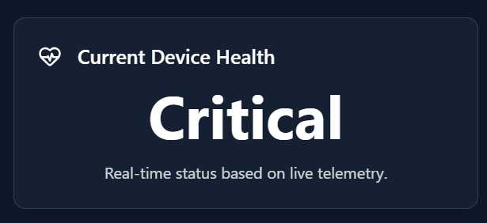

# Team

## CodeGalaxy – VIT Vellore

- Haani Behzad Kuniyil (22MIC0179)
- Sujal Ravindra Dixit (22MIC0115)
- Keerthana Krishnan T (22MID0038)
- Drisanth M (22MIC0139)
- Darsh Marothi (22MID0333)

# Aura – Autonomous Device Health & Support Ecosystem

## Overview

Aura is an always-on **device health companion** that monitors all Samsung devices — smartphones, TVs, appliances, and wearables — using multimodal AI.
It predicts failures, performs remote fixes, and coordinates service **without human intervention**.

The solution is powered by a **multi-agent system** with specialized AI agents for:

- Diagnostics
- Predictive Maintenance
- Customer Interaction
- Service Coordination
- System Optimization

This ensures **proactive support**, reducing downtime, extending device lifespan, and providing a seamless user experience.

---

# Demonstration Video

You can click on this link to view a video which explains the working of our application:
https://drive.google.com/file/d/14MWElS6rdMx7NB3bTYXWyxB_l_OrEv6T/view?usp=sharing

---

# Project Setup

This project consists of a **server**, a **client**, and a **Python environment**. Follow the steps below to set everything up.

---

## 🔧 Server Setup

1. Navigate to the `server` directory:

   ```bash
   cd server
   ```
2. Create a `.env` file inside the `server` folder and add the following keys:

   ```env
   MONGODB_URI=your_mongodb_uri_here
   GEMINI_API_KEY=your_gemini_api_key_here
   HUGGINGFACE_API_KEY=your_huggingface_api_key_here
   ```
3. Install dependencies:

   ```bash
   npm install
   ```
4. Start the development server:

   ```bash
   npm run dev
   ```

---

## 💻 Client Setup

1. Navigate to the `client` directory:

   ```bash
   cd client
   ```
2. Install dependencies:

   ```bash
   npm install
   ```
3. Start the client development server:

   ```bash
   npm run dev
   ```

---

## 🐍 Python Environment Setup

1. In the **root directory** of the project, create a virtual environment:

   ```bash
   python -m venv .venv
   ```
2. Activate the virtual environment:

   - **Windows (PowerShell):**

     ```bash
     .venv\Scripts\activate
     ```
   - **Linux/MacOS:**

     ```bash
     source .venv/bin/activate
     ```
3. Install the required Python packages:

   ```bash
   pip install -r requirements.txt
   ```


## 🤖 Running Model Simulations Directly

For users who want to test the AI models directly without running the full web application, the **simulation_scripts** folder contains standalone Python scripts for each device.

1. **Ensure your Python environment is activated.**
2. **Navigate to the simulation scripts directory:**

   ```
   cd simulation_scripts/sim_scripts

   ```
3. **Run the desired simulation script. For example:**

   ```
   python SmartfridgePredNewSim.py

   ```

   **This will run a full simulation in your terminal and print the final verdict.**


## 📊 Using the Dashboard

After setting up and running both the **server** and the **client**, open the application in your browser. The application currently does not support support real-time data, so we have to simulate scenarios. The simulation script is inside **simulation_loop.py** in the root directory.

1. Navigate to the **Dashboard** page.
2. Select the **device** you wish to test.
3. Inside the device view, you can simulate real-time data ingestion.

👉 Choose a simulation of your choice.

---

### 🖼️ Dashboard Walkthrough (Screenshots go here)

- **Dashboard:**
  
  
  

- **Device Selection:**
  
  

---

### 📌 Dashboard Layout

Once inside the dashboard, you will see **three main sections**:

1. **Classification Model**

   - **Displays the ****real-time status** (Normal, Warning, Critical) of the device.
   - Powered by a TensorFlow/Keras LSTM Neural Network.

   
2. **Predictive Model**

   - **Provides a look into the ****future health** of the device using a multi-agent system.
   - **Risk Screener Agent:** Answers *"Will it fail?"*
   - **Root Cause Agent:** Answers *"Why will it fail?"*
   - **Forecast Agent:** Answers *"When will it fail?"*

   
3. **Live Health Graph**

   - A dual-axis graph that visualizes the output of both AI models on a single timeline.

   

---

### 📸 Visual Input Section

In the **Visual Input** section, you can upload an image of your **broken device** or a **specific component**.
The AI will analyze the image and provide a **recommended fix**.


---

### 🎙️ Audio Section

In the **Audio** section, you can interact with the **AI bot** through voice chat.
The bot will listen to your issue and provide **recommended solutions** in real time.


---

### 📑 Report Generation Section

The **Report Generation** section provides a **summarized and diagnostic report** of all your activities, including:

- 🖥️ **Simulated Testing Results** (CPU/Battery faults)
- 📸 **Visual Input Analysis** (uploaded device/component images)
- 🎙️ **Audio Interaction Logs** (AI chat recommendations)

This report helps in understanding the overall system health and suggested fixes in one place.


You can also download your report as a pdf.


---
